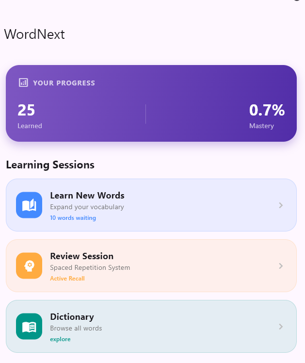
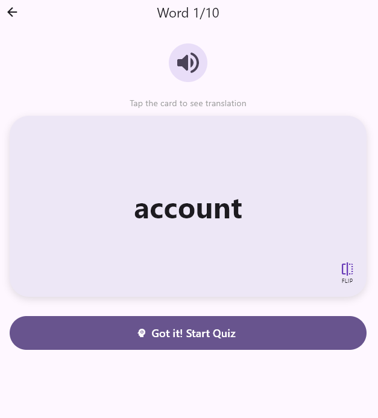
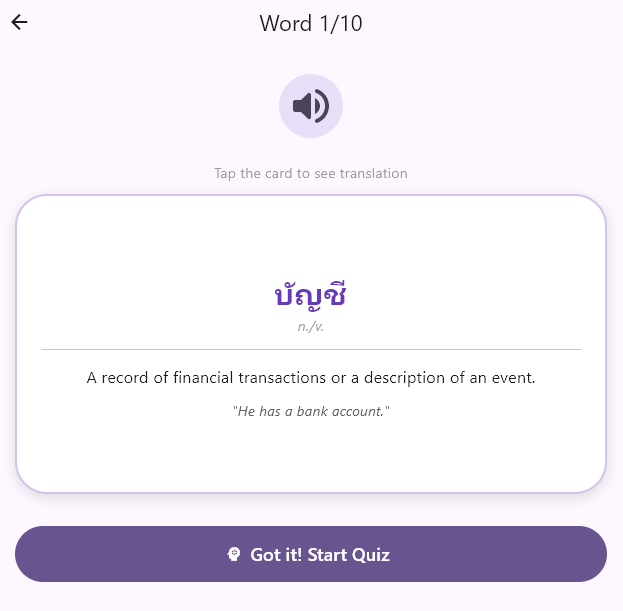
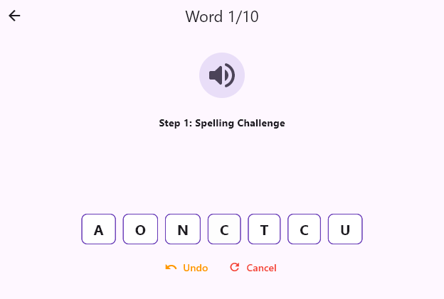
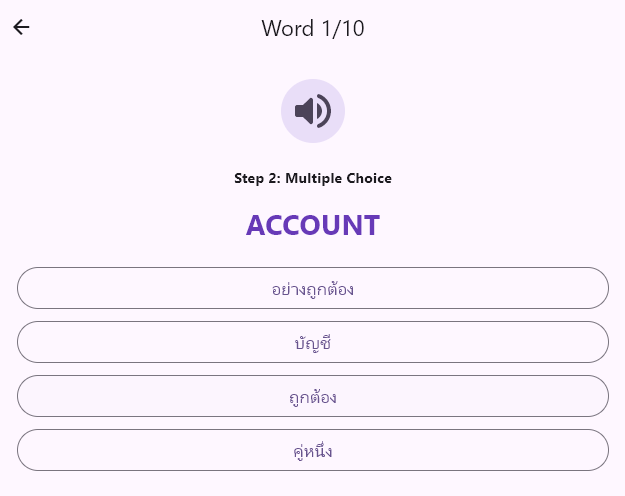
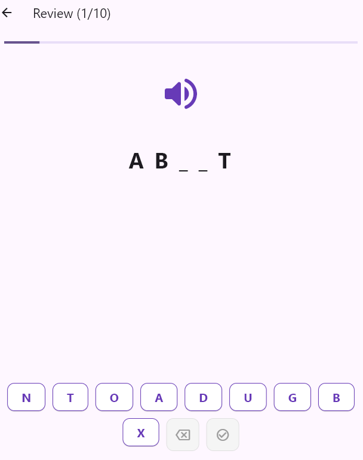
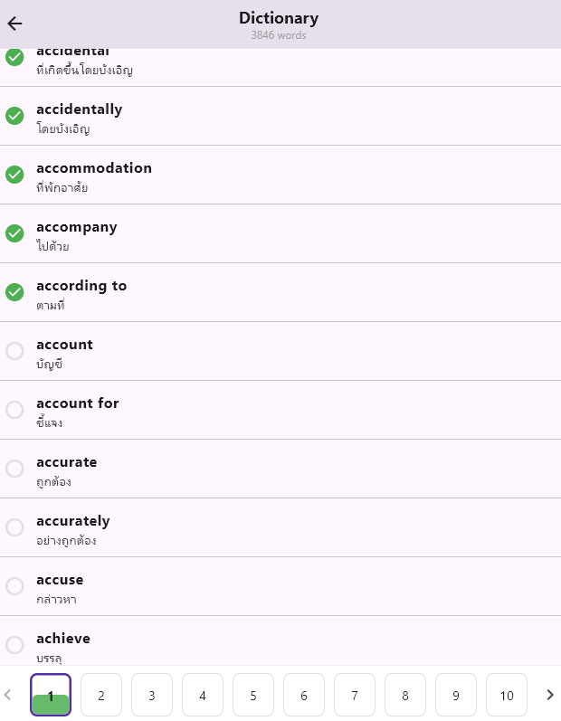

# wordnext

## คำนำ
***wordnext*** เป็นแอพที่เกิดมาเพื่อท่องศัพท์โดยเฉพาะ ซึ่งศัพท์ที่ว่านั้นมี 3000 คำ โดยเน้นหลักการ **Active Recall** เพื่อให้จำได้อย่างลึกซึ้งจริงๆ



## โหมดการเล่น
### 1. **Learn New Words**

ที่โหมดนี้คุณได้อ่าน Flashcard และมีเสียงอ่านคำศัพท์นั้นจริงๆ





> เมื่อคุณคิดว่าจำได้แล้วให้กด Got it ระบบจะทดสอบคุณด้วยการสะกดคำ และความหมายแบบ Choices





### 2. Review Session

โหมดนี้จะนำคำศัพท์มาทวนความทรงจำของคุณ และมีการเช็คว่าคุณจำความหมายได้เป็น Choices



### 2. Dictionary

เก็บรวบรวมคำศัพท์ไว้และบันทึกความสำเร็จของคุณ



## การติดตั้ง

### Windows

ให้ใช้ Branch `build/windows`

```bash
git clone -b build/windows [https://github.com/Nextjingjing/wordnext.git](https://github.com/Nextjingjing/wordnext.git)
cd wordnext
```

ติดตั้ง Dependencies

```bash
flutter pub get
```

ฺีBuild application

```bash
flutter build windows
```

จะได้ไฟล์ .exe มาใน ```build/windows/x64/runner/Release/```

### Android

ให้ใช้ Branch `main`

```bash
git clone https://github.com/Nextjingjing/wordnext.git
cd wordnext
```

ติดตั้ง Dependencies

```bash
flutter pub get
```

ฺีBuild application

```bash
flutter build apk
```

จะได้ไฟล์ .apk มาใน ```build/app/outputs/flutter-apk/app-release.apk```
