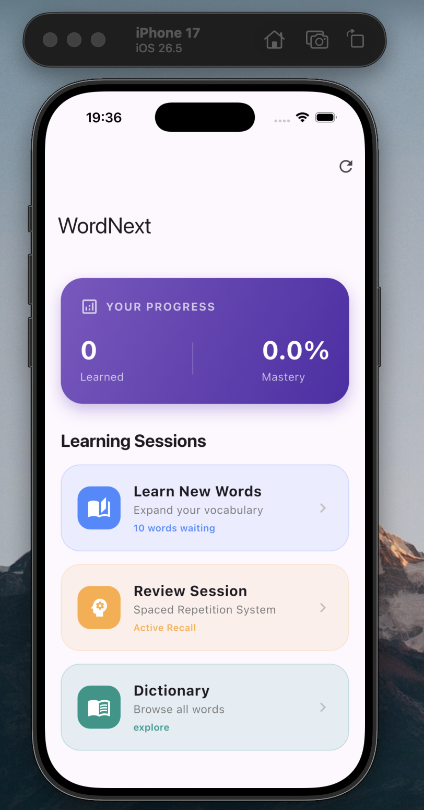

# wordnext

แอปฝึกคำศัพท์ภาษาอังกฤษบน Flutter รองรับการเรียนรู้แบบ Flashcard, Spaced Repetition Review, และ Dictionary พร้อม Text-to-Speech (TTS) ออกเสียงคำศัพท์

<p align="center">
  
  <br/>
  <em>WordNext running on iPhone 17 Simulator (iOS 26.5)</em>
</p>

## Features

- **Learn New Words** — Flashcard mode + quiz (spelling + meaning multiple choice)
- **Review Session** — Spaced Repetition System (SRS) เน้น active recall
- **Dictionary** — เรียกดูคำศัพท์ทั้งหมดพร้อม pagination และเล่นเสียง pronunciation
- **Progress Tracking** — บันทึกสถานะคำที่เรียนแล้ว/ยังไม่ได้เรียน
- **Cross-platform** — Android, iOS, macOS, Linux, Windows, Web

## Tech Stack

| Layer | Library |
|------|------|
| Framework | Flutter 3.11+ / Dart 3.11+ |
| Local DB | `sqflite` |
| File paths | `path_provider`, `path` |
| TTS | `flutter_tts` (iOS: AVAudioSession, Android: native TTS engine) |
| Lints | `flutter_lints` |
| App icons | `flutter_launcher_icons` |

## Project Structure

โครงสร้างแบบ Clean Architecture แยก domain/infrastructure/presentation

```
lib/
├── main.dart
├── domain/
│   ├── entities/vocab.dart                    # Vocab entity
│   ├── repositories/vocab_repository.dart     # Abstract contract
│   └── services/vocab_service.dart            # Use cases
├── infrastructure/
│   ├── database/database_helper.dart          # SQLite bootstrap (copies assets/wordnext.db)
│   ├── repositories/sqlite_vocab_repository.dart
│   └── tts/tts_config.dart                    # Cross-platform TTS audio session config
└── presentation/pages/
    ├── home_page.dart
    ├── learning_page.dart                     # Flashcard + quiz
    ├── review_page.dart                       # SRS review
    └── dictionary_page.dart

assets/
├── wordnext.db                                # Pre-seeded SQLite vocabulary database
└── app_icon.png                               # Source icon for flutter_launcher_icons
```

## Getting Started

### Prerequisites

- **Flutter SDK** 3.11+ (`brew install --cask flutter`)
- **Dart SDK** (ติดมากับ Flutter)
- **iOS dev** — Xcode 26+ จาก Mac App Store, ติดตั้ง iOS platform/Simulator runtime ผ่าน Xcode → Settings → Components
- **Android dev** — Android Studio + Android SDK
- **CocoaPods** สำหรับ iOS (`brew install cocoapods`)

ตรวจสอบสภาพแวดล้อม
```bash
flutter doctor -v
```

### Install Dependencies

```bash
flutter pub get
```

### Generate Launcher Icons (ครั้งแรก หรือเมื่อเปลี่ยน assets/app_icon.png)

```bash
dart run flutter_launcher_icons
```

## Building

### iOS Simulator

```bash
flutter build ios --simulator --debug
open -a Simulator
flutter run -d "iPhone 17"          # หรือชื่อ simulator อื่นจาก `flutter devices`
```

หรือถ้าต้องการแค่ build ไม่รัน
```bash
flutter build ios --simulator --debug
xcrun simctl install booted build/ios/iphonesimulator/Runner.app
xcrun simctl launch booted com.example.wordnext
```

### iOS Device (TestFlight / sideload)

ต้องการ Apple Developer signing setup
```bash
xcodebuild -downloadPlatform iOS    # ครั้งแรกถ้ายังไม่มี device platform
flutter build ios --release         # ต้องตั้ง signing ใน Xcode ก่อน
```

แล้วเปิด `ios/Runner.xcworkspace` ใน Xcode → ตั้ง Team + Bundle ID → Archive

### Android

```bash
flutter build apk --release           # APK
flutter build appbundle --release     # AAB สำหรับ Play Store
flutter run -d <android-device-id>
```

### Web

```bash
flutter build web --release
flutter run -d chrome
```

### macOS / Linux / Windows

```bash
flutter build macos --release
flutter build linux --release
flutter build windows --release
```

## Running Tests & Analysis

```bash
flutter analyze                       # Static analysis (lint)
flutter test                          # Widget + unit tests
```

## Notes for Developers

### iOS TTS Audio Session

`flutter_tts` บน iOS ต้องเซ็ต `AVAudioSession` ให้ถูกต้อง มิเช่นนั้น **เสียงจะไม่เล่นตอน silent switch เปิด** (default category คือ `ambient` ซึ่งถูก mute)

โปรเจกต์นี้แก้ปัญหาด้วย helper [lib/infrastructure/tts/tts_config.dart](lib/infrastructure/tts/tts_config.dart) ที่ตั้ง category เป็น `playback` + รองรับ Bluetooth + mix กับเสียงอื่น เรียกใน `initState()` ของทุกหน้าที่ใช้ TTS

```dart
import '../../infrastructure/tts/tts_config.dart';

@override
void initState() {
  super.initState();
  configureTtsForPlatform(_tts);   // no-op บนแพลตฟอร์มอื่นนอกจาก iOS
  ...
}
```

ถ้าเพิ่มหน้าใหม่ที่ใช้ `FlutterTts` ให้เรียก `configureTtsForPlatform()` ทุกครั้ง

### Database Bootstrap

`assets/wordnext.db` เป็น SQLite ที่ pre-seed มาก่อน ตอนเปิดแอปครั้งแรก [database_helper.dart](lib/infrastructure/database/database_helper.dart) จะ copy ไฟล์นี้ไปไว้ที่ `path_provider`'s documents directory

ถ้าแก้ schema/ข้อมูลใน `assets/wordnext.db` แล้วต้องการให้อัพเดทบนเครื่อง — ลบแอปทิ้งแล้วติดตั้งใหม่ หรือล้าง simulator (`xcrun simctl erase booted`)

### Bundle Identifier

ปัจจุบันใช้ `com.example.wordnext` (placeholder) ก่อน submit App Store/Play Store ให้เปลี่ยนใน:

- iOS: `ios/Runner.xcodeproj/project.pbxproj` → `PRODUCT_BUNDLE_IDENTIFIER`
- Android: `android/app/build.gradle` → `applicationId`

### Known Warnings

- `flutter analyze` แสดง info-level warnings เกี่ยวกับ `withOpacity` deprecated และ unused fields ใน `home_page.dart`, `review_page.dart` — ไม่บล็อก build
- `flutter build web` แสดง wasm dry-run warnings จาก `flutter_tts` (third-party) — ไม่กระทบ JS build

### Troubleshooting

| ปัญหา | วิธีแก้ |
|------|------|
| `Application not configured for iOS` | รัน `flutter create . --platforms=ios` (ระวัง `.metadata` จะถูกแก้ — git checkout ถ้าจำเป็น) |
| `xcrun: error: SDK "iphoneos" cannot be located` | ติดตั้ง Xcode.app เต็มตัว (ไม่ใช่แค่ Command Line Tools) แล้ว `sudo xcode-select --switch /Applications/Xcode.app/Contents/Developer` |
| `iOS X.X Platform Not Installed` | `xcodebuild -downloadPlatform iOS` หรือ Xcode → Settings → Components |
| `You have not agreed to the Xcode license` | `sudo xcodebuild -license` แล้วพิมพ์ `agree` |
| TTS เงียบบน iPhone เมื่อ silent switch เปิด | ตรวจสอบว่าเรียก `configureTtsForPlatform(_tts)` ใน `initState()` แล้ว |
| Pod install ล้มเหลว | `cd ios && pod repo update && pod install --repo-update` |

## License

Internal/educational project — ยังไม่ได้กำหนด license สำหรับ public distribution
